# Flights Flask Application

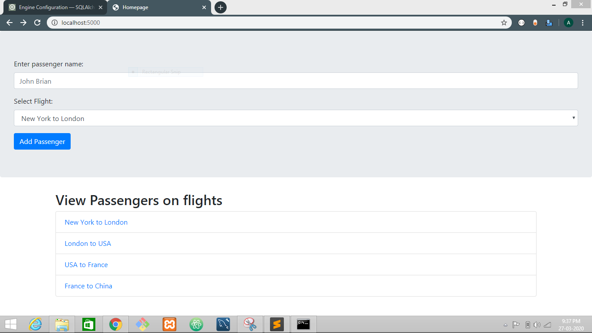
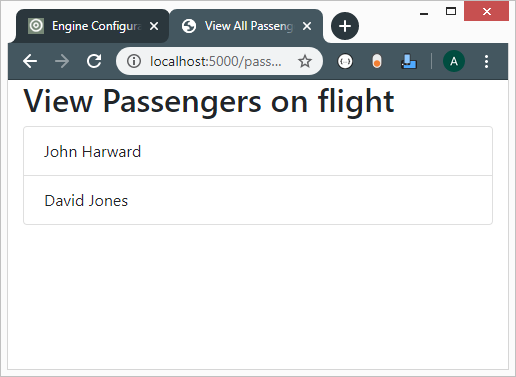

## Application Specification

The app should implement the following features:

-   List All flights.
-   Book a flight.
-   View all passengers in a flight.
-   App should be implemented using Flask

To keep the app minimum, I decided to keep the application simple. The app will not provide use any authentication. The application will help us understand about:

-   Creating a virtual environment
-   Defining Routes in Flask app.
-   Rendering HTML files in flask app.
-   Handling Get and POST requests in flask app.
-   Handling Form Submission in flask app
-   Working with database in flask app

## Challenge 1: Hello World Flask app

To create a basic flask app that prints **Hello, World**, we need to setup the project structure.

The project Structure will look as:

```
flights
	| app.py
```

The above structure has a folder **flights** and an **app.py** file inside it.

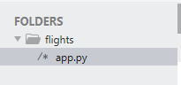

### Virtual Environment

_Virtual Environment_ is a workspace that holds all your project requirements and the exact versions of the external modules used in the project.

_Virtual Environment_ helps to seperate the dependencies based on the project.

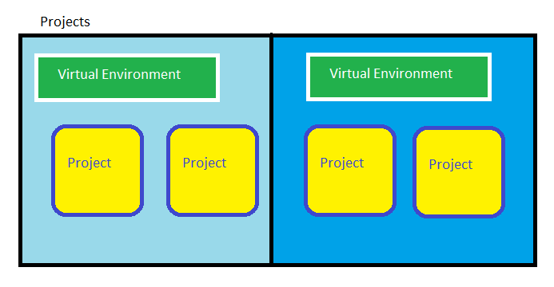

### Creating Virtual Environment

The steps to create the virtual environment are:

-   Navigate to the flights folder
-   Open the **CMD** / **Command Prompt** / **Terminal** in this directory
-                                                                                                                                                                                                                 Now execute the following command in the terminal

```bash
python -m venv venv
```

Syntax:

```bash
python -m venv environment_name
```

The explanation of the above command is:

1. **python** is the programming language executable
2. **-m** is the commandline option passed to the python executable
3. **venv** is the module name that creates the virtual environment
4. **venv** is the name of virtual environment folder that will be created by the _venv_ module of python.

The above commands contains two **venv** words in the syntax. **The first venv is the module name** and **The second venv is the name of virtual environment**.

### Activating the Virtual Environment

To activate the virtual environment the following commands will be used:

**Before executing the below commands navigate to flights directory used for project**

On Windows:

```bash
cd venv/Scripts
activate
```

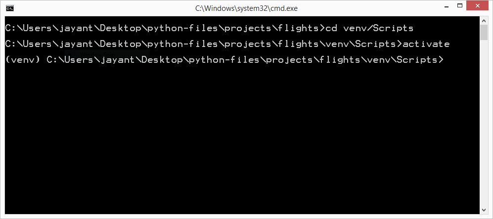

On Linux or MAC:

```bash
source venv/bin/activate
```

### Installing dependencies in the virtual environment

Now, we are able to install modules in our virtual environment. To install the virtual environment execute the following command:

Syntax:

```bash
pip install package_name
```

Command:

```bash
pip install flask
```

### Creating Hello World App

Follow the below steps:

-   Open app.py file

```py
# Import Flask class to create an app object
from flask import Flask


# Create an app
app = Flask(__name__)

# Configure the / route
@app.route('/')
def index():
	return "Hello, World"

# Start the app
if __name__ == "__main__":
	app.run()
```

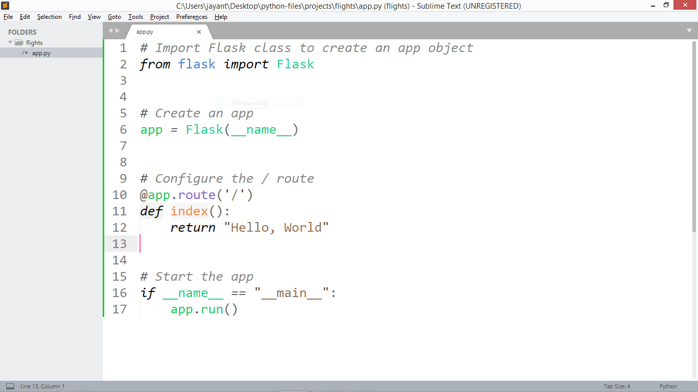

The code performs the following steps:

1. Imports Flask class from the flask module.
2. Creates an app object using Flask class
3. Defines the index route using **app.route('location')** syntax.
4. **index** function is executed when the **/** route is accessed
5. At last we run our flask app, using **app.run()**

### Testing our app

Now open the **CMD** or the **Terminal** in the project directory and execute the following command.

```bash
flask run
```

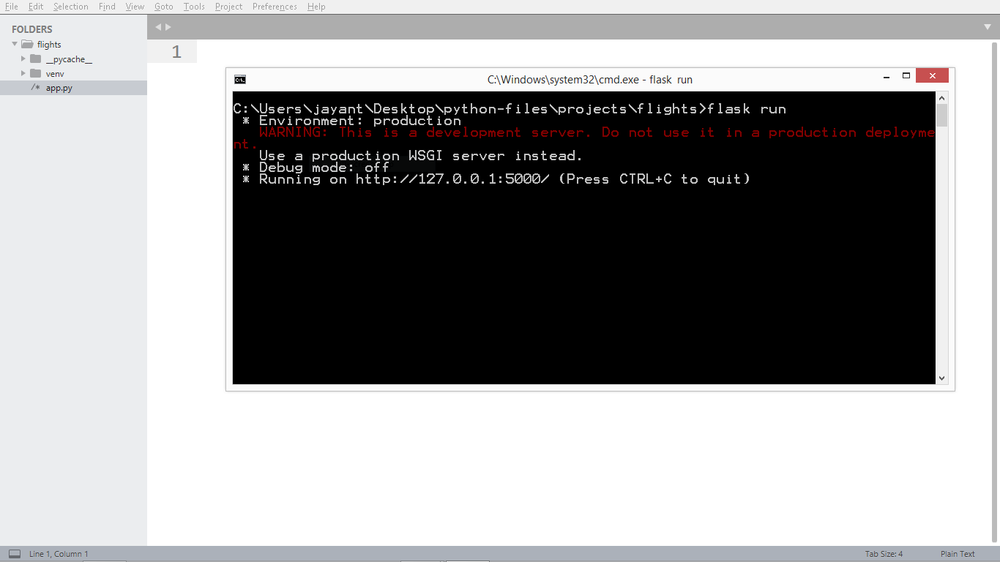

The above command will start the flask web server at [http://127.0.0.1:5000](http://localhost:5000)

Now open your web browser at the following URL and you will see your flask app working.

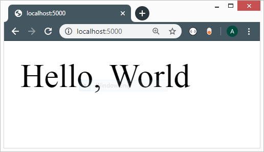

## Challenge 2: Rendering HTML files

### Setup the Debug Mode

In the above app if you change the **return statement** of **app.py** file **index** function to print **Welcome, Mr. User**, then the contents of the web browser will not change. This is because each time we make a change to our project files, we need to restart the server.

So, we need a way to automatically restart the start each time, we make a change in our code. **Flask already has the feature allowing auto restart of server**.

We need to enable the debug feature of the flask app.

To enable the debug feature just set the environment variable to following:

On Windows:

```bash
set FLASK_ENV=development
```

On Linux:

```bash
export FLASK_ENV=development
```

The above lines will set the **FLASK_ENV** variable to **development** for current instance of the **CMD** or **Terminal**.

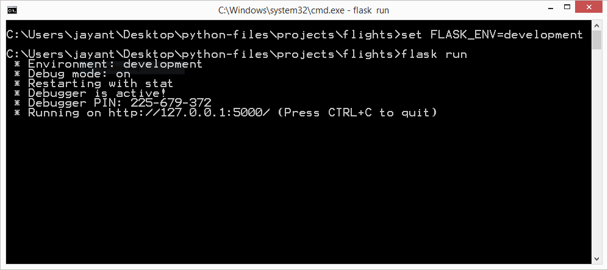

If you want to permanently set the **FLASK_ENV** add the above line to **~/.bashrc** file on linux and for windows user, I do not know how to do it permanently.

The another option is to modify the app.py file

```python
if __name__ == "__main__":
	app.run(debug=True)
```

Both the ways will result in the desired outcome, of auto restarting the server each time **app.py** is updated.

### Creating Directory Structure

In order to serve the **HTML** files flask uses a fixed directory structure as follows:

```
- flights/
	| - templates/
	|		|	index.html
	|		|	home.html
	|		| 	layout.html
	| - static/
			|	css/
			|	js/
			|	assets/
```

In the above diagram we have a **flights** folder containing two sub folders **templates** and **static**.

**templates** folder will contain all the **HTML** files to be served
**static** folder will contain all the **CSS**, **Javascript**, **images**, or **other assets** such as videos for website.

> The folder hierachy is important because **flask will specifically look for templates and static folder**, if _the content is placed in other folder the app will not work as required_.

### Creating Index File

Let's create a **index.html** file inside **templates** folder.

```
- flights/
	|	- templates/
	|		|	index.html

```

Contents of **index.html** file:

```html
<!DOCTYPE html>
<html lang="en" dir="ltr">
	<head>
		<title>Homepage</title>
		<meta charset="utf-8" />
	</head>
	<body>
		<h1>Welcome to the flask website</h1>
	</body>
</html>
```

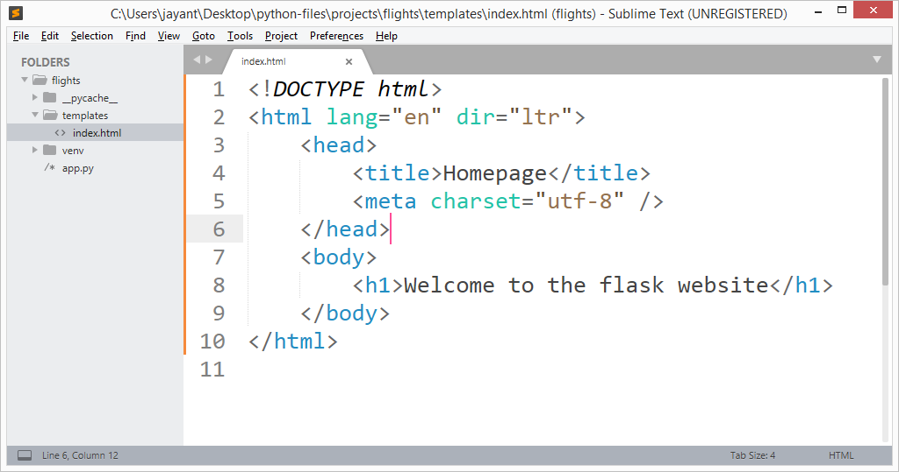

Now to serve the html file to the user using our flask app, we need to perform the following steps:

1. Import the **render_template** function from flask
2. Return the **render_template('filename.html')** from flask route

So, app.py will be:

```python
from flask import Flask, render_template

# Create an app
app = Flask(__name__)

# Define the index route
@app.route('/')
def index():

	# Render the HTML file
	return render_template('index.html')

# Start the app
if __name__ == "__main__":
	app.run()
```

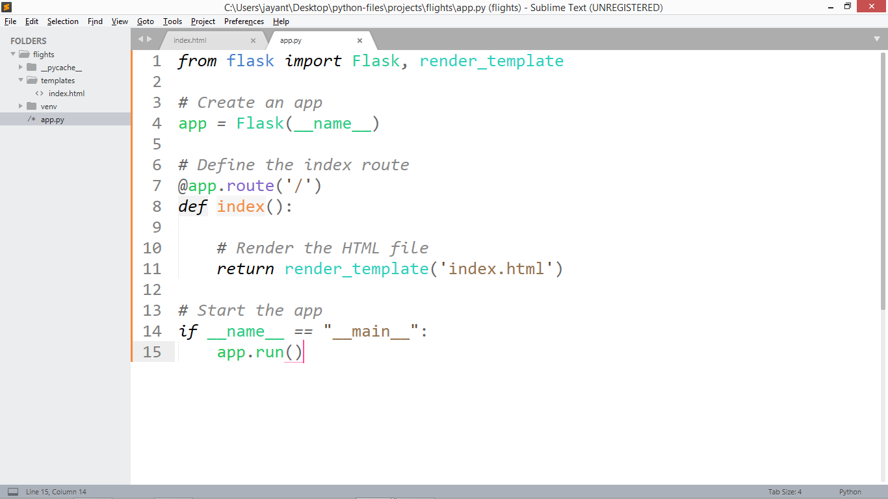

### Practice time

Try to change the contents of the **index.html** file and and answer the following questions:

-   Does the flask server restart?
-   Does the change in contents of the **index.html** file gets changed on the user screen, when the user reloads the page?
-   Does renaming **templates** folder to something else, works?
-   Does the removal of **app.run()** keeps your app running?

## Challenge 3: Handling GET and POST requests

There are various types of requests that can be made using **HTTP**

| Method | Description                        |
| ------ | ---------------------------------- |
| GET    | Retrieve content from server       |
| POST   | Submit content to server           |
| PUT    | Update content on server           |
| DELETE | Delete content from server         |
| PATCH  | Update a part of content on server |

and there are even more...

The above methods also helps us create **apis** using flask.

## Creating Form to submit data

Before implementing **GET** or **POST** in **app.py** file we, first need to create an html form which will allow us to submit data to the server.

Below html code will generate the **HTML FORM** for us.

```html
<!-- Replace <h1>Welcome...</h1> with the content below -->

<div class="jumbotron">
	<form>
		<div class="form-group">
			<label for="passenger">Enter passenger name: </label>
			<input
				type="text"
				class="form-control"
				name="passenger-name"
				id="passenger"
				required
				autofocus
				placeholder="John Brian"
			/>
		</div>
		<div class="form-group mt-2">
			<label for="flight">Select Flight: </label>
			<select name="flight" id="flight" class="form-control">
				<option value="moscow-paris">Moscow to Paris</option>
				<option value="moscow-paris">Paris to London</option>
				<option value="moscow-paris">Paris to USA</option>
				<option value="moscow-paris">London to INDIA</option>
			</select>
		</div>
		<button type="submit" class="btn btn-primary">
			Add Passenger
		</button>
	</form>
</div>
```

To style the html file we need to include the bootstrap css file. For including the bootstrap file visit: [getbootstrap.com](https://getbootstrap.com) and navigate to documentation, then copy the **CDN** css link and paste it in **index.html** file.

The complete html file becomes:

```html
<!DOCTYPE html>
<html lang="en" dir="ltr">
	<head>
		<title>Homepage</title>
		<meta charset="utf-8" />
		<link
			rel="stylesheet"
			href="https://stackpath.bootstrapcdn.com/bootstrap/4.4.1/css/bootstrap.min.css"
		/>
	</head>
	<body>
		<div class="jumbotron">
			<form>
				<div class="form-group">
					<label for="passenger">Enter passenger name: </label>
					<input
						type="text"
						class="form-control"
						name="passenger-name"
						id="passenger"
						required
						autofocus
						placeholder="John Brian"
					/>
				</div>
				<div class="form-group mt-2">
					<label for="flight">Select Flight: </label>
					<select name="flight" id="flight" class="form-control">
						<option value="moscow-paris">Moscow to Paris</option>
						<option value="moscow-paris">Paris to London</option>
						<option value="moscow-paris">Paris to USA</option>
						<option value="moscow-paris">London to INDIA</option>
					</select>
				</div>
				<button type="submit" class="btn btn-primary">
					Add Passenger
				</button>
			</form>
		</div>
	</body>
</html>
```

We need to implement the following in **index.html** file:

1. Configure form to send **post** request to server
2. Configure form to use a specific url when sending request.

The 1st step is simple, as we need to only specify a attribute to the form tag.

```html
<!-- method will specify the type of request to send -->
<!-- only get and post request are supported by html -->
<form method="post"></form>
```

_Go ahead and change the form element to use post method_, before continuing.

Now, let's proceed with the 2nd requirement of specifying the url for sending requirements.

To specify an _URL_, we need to create a route in **app.py** file. We will be creating this route later, for now let's assume we create a **add-passenger** route in **app.py** file and complete our **index.html** file.

```html
<!-- action attribute allows us 
specify the url for sending requests. -->
<form action="/add-passenger"></form>

<!-- flask uses jinja2 template engine
so we can also use another syntax. -->
<form action="{{url_for('addPassenger')}}"></form>
```

The above snippet shows two ways of specifying the action in **index.html** file, Both of them are used, as per the requirements. But for most of the cases the second syntax(jinja2 syntax) is preferred over the first one.

**Jinja2** is a template engine, which processes the _special queries put in double braces_, before rendering the html file.

**addPassenger** is the above syntax is the function name, which we will create in **app.py** file.

### Receiving Data in app.py file

To receive the data let's implement the **app.py** file, the process will require three steps:

1. Import the request object from flask
2. Create a route and configure it to accept POST requests.
3. Get the data using request object

The three steps will look as follows:

```py
# Import request object
from flask import request

# This is Partial file....

# Create a route
@app.route('/add-passenger', methods=["POST"])
def addPassenger():
	# Extract information from form
	passenger = request.form.get('passenger-name')
	flight = request.form.get('flight-id')

	return f"Passenger: {passenger}, Flight: {flight}"
```

Now, to complete the **app.py** update the **app.py** file to following:

```python
from flask import Flask, render_template, request

# Create an app
app = Flask(__name__)

# Define the index route
@app.route('/')
def index():

    # Render the HTML file
    return render_template('index.html')


# Create a route
@app.route('/add-passenger', methods=["POST"])
def addPassenger():
	# Extract information from form
	passenger = request.form.get('passenger-name')
	flight = request.form.get('flight-id')

	return f"Passenger: {passenger}, Flight: {flight}"

# Start the app
if __name__ == "__main__":
    app.run()

```

The final completed **html** and **python files** are:

```html
<!DOCTYPE html>
<html lang="en" dir="ltr">
	<head>
		<title>Homepage</title>
		<meta charset="utf-8" />
		<link
			rel="stylesheet"
			href="https://stackpath.bootstrapcdn.com/bootstrap/4.4.1/css/bootstrap.min.css"
		/>
	</head>
	<body>
		<div class="jumbotron">
			<form action="{{url_for('addPassenger')}}" method="post">
				<div class="form-group">
					<label for="passenger">Enter passenger name: </label>
					<input
						type="text"
						class="form-control"
						name="passenger-name"
						id="passenger"
						required
						autofocus
						placeholder="John Brian"
					/>
				</div>
				<div class="form-group mt-2">
					<label for="flight">Select Flight: </label>
					<select name="flight-id" id="flight" class="form-control">
						<option value="1">Moscow to Paris</option>
						<option value="2">Paris to London</option>
						<option value="3">Paris to USA</option>
						<option value="4">London to INDIA</option>
					</select>
				</div>
				<button type="submit" class="btn btn-primary">
					Add Passenger
				</button>
			</form>
		</div>
	</body>
</html>
```

```py
from flask import Flask, render_template, request

# Create an app
app = Flask(__name__)

# Define the index route
@app.route('/')
def index():

    # Render the HTML file
    return render_template('index.html')


# Create a route
@app.route('/add-passenger', methods=["POST"])
def addPassenger():
	# Extract information from form
	passenger = request.form.get('passenger-name')
	flight = request.form.get('flight-id')

	return f"Passenger: {passenger}, Flight: {flight}"

# Start the app
if __name__ == "__main__":
    app.run()

```

The output of the above steps will look as follows:

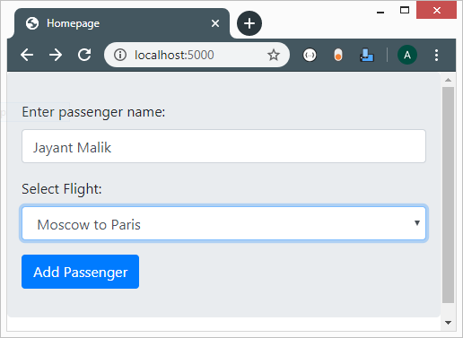

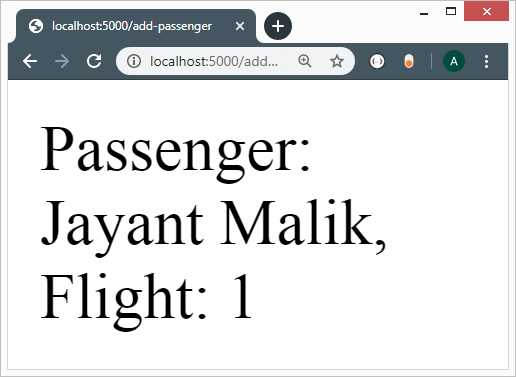

## Challenge 4: Working with database

To work with database we will use a package **SQLALCHEMY**. SQLAlchemy allows us to execute sql commands from inside of our flask app.

> Note: We could execute sql commands using pure Python, without using any dependencies. But, for production applications, we want to ensure complete security, and prevent hacks or attacks like **SQL INJECTION**. Hence, we use **SQLAlchemy**.

### What Database to use?

Today, we have several options to consider, for production apps, such as :

| Database      | Data Stored | Description                                                                                                      |
| ------------- | ----------- | ---------------------------------------------------------------------------------------------------------------- |
| SQLite        | On Device   | Used for offline applications, such as android apps, and apps which do not require user to store data on server. |
| MYSQL         | On Server   | Most used online database engine.                                                                                |
| Postgres      | On server   | Alternative to MYSQL                                                                                             |
| Oracle DB     | On server   | I don't use it.                                                                                                  |
| MS SQL Server | On server   | Alternative to mysql, but only available on Windows, now microsoft is trying to make it available on linux       |

For our purpose, the application will remain on our local development machine. We are not planning to deploy it online. So, we can use SQLITE.

### Install SQLAlchemy

Run the below command to install SQLAlchemy :

```python
pip install sqlalchemy
```

### Using Sqlalchemy

Creating an application, that only works is not the goal of this tutorial. We have the following goal:

-   Application should work
-   Application should be secure.

To keep the application secure, we will set the **DATABASE_URL** in our **TERMINAL** or **CMD** as environment variable, and then we will use it.

The steps to take are:

-   Set an environment variable with **DATABASE_URL** name.
-   Use environment variable in **app.py** file for connecting to database.

To setup the database url we will run the following commands:

on Windows:

```bash
set DATABASE_URL=sqlite:///flights.db
```

on Linux:

```bash
export DATABASE_URL=sqlite:///flights.db
```

Our environment variable is set correctly, now we need to configure our **app.py** file to use database for storing information.

The steps to implement sqlalchemy are:

1. Import sqlalchemy.
2. create database engine to execute query.
3. Execute the **SQL** statement.

```python
# import sqlalchemy class
from sqlalchemy import create_engine

# Create database engine to execute commands
db = create_engine('DATABASE URI')

# Execute the query
db.execute('SQL QUERY HERE')
```

The implementaion in **app.py** will look as:

```python
from flask import Flask, render_template, request
from sqlalchemy import create_engine
import os

# Create an app
app = Flask(__name__)

if not os.getenv('DATABASE_URL'):
	raise Exception("Database url is not set.")

db = create_engine(os.getenv('DATABASE_URL'))


# Define the index route
@app.route('/')
def index():

    # Render the HTML file
    return render_template('index.html')


# Create a route
@app.route('/add-passenger', methods=["POST"])
def addPassenger():
	# Extract information from form
	passenger = request.form.get('passenger-name')
	flight = request.form.get('flight-id')

	return f"Passenger: {passenger}, Flight: {flight}"

# Start the app
if __name__ == "__main__":
    app.run()

```

Notice that, we have not executed any query in the above **app.py** source code. This is what we will be doing next.

### Preparing Database

In order to create tables to store data of our flights we need to execute sql queries on our database. We will be doing this stuff in a seperate **python file** in the current project.

The idea is to:

1. Create a **create_tables.py** file in current project
2. Write _python_ and _sql_ code to create tables.
3. Execute the **create_tables.py** script using python interpreter.

#### Step 1: (Creating **create_tables.py** file)

Create a new **create_tables.py** file in the current project, the directory structure will look as follows:

```
- flights/
	|	app.py
	|	create_tables.py
	|	templates/
			|	index.html
```

#### Step 2: (Writing SQL queries to create tables)

The idea is:

1. Create a basic flask app
2. Import sqlalchemy and create db engine
3. Execute sql queries using sqlalchemy
4. Exit the program.

The code will look as follows:

```python
# Import sqlalchemy and os
from sqlalchemy import create_engine
import os

# CHECK IF ENVIRONMENT VARIABLE IS SET
if not os.getenv('DATABASE_URL'):
	raise Exception('DATABASE URL IS NOT SET.')

# Create db instance
db = create_engine(os.getenv('DATABASE_URL'))

# Start the flask app
if __name__ == "__main__":
	# Execute the sql commands here
	pass

```

Now, its time to write _SQL_ queries, and create two tables:

-   One table will hold all the passengers.
-   One table will hold all the flights.

The idea behind flights table is that:

-   Every flight will have some **origin**, **destination** and **duration** in hours of the flight.

The sql queries for flights table

```sql
CREATE TABLE IF NOT EXISTS flights(
	id INTEGER PRIMARY KEY AUTOINCREMENT,
	origin VARCHAR(30) NOT NULL,
	destination VARCHAR(30) NOT NULL,
	duration INTEGER NOT NULL
);
```

The idea behind passengers table is that:

-   Every passenger will travel using some **flight** and he or she will have a **name**.

The sql query for passengers table is:

```sql
CREATE TABLE IF NOT EXISTS passengers(
	id INTEGER PRIMARY KEY AUTOINCREMENT,
	name VARCHAR(30) NOT NULL,
	flight_id INTEGER NOT NULL,
	FOREIGN KEY(flight_id) REFERENCES "flights.id"
);
```

Now, contents of **create_tables.py** file will be:

```py
# Import flask and sqlalchemy
from sqlalchemy import create_engine
import os

# CHECK IF ENVIRONMENT VARIABLE IS SET
if not os.getenv('DATABASE_URL'):
	raise Exception('DATABASE URL IS NOT SET.')

# Create db instance
db = create_engine(os.getenv('DATABASE_URL'))

# Execute the database queries.
if __name__ == "__main__":
	# =========================
	#	FLights Table
	# =========================
	db.execute("""
		CREATE TABLE IF NOT EXISTS flights(
		id INTEGER PRIMARY KEY AUTOINCREMENT,
		origin VARCHAR(30) NOT NULL,
		destination VARCHAR(30) NOT NULL,
		duration INTEGER NOT NULL
		);""")


	# =========================
	#	Passengers Table
	# =========================

	db.execute("""
		CREATE TABLE IF NOT EXISTS passengers(
		id INTEGER PRIMARY KEY AUTOINCREMENT,
		name VARCHAR(30) NOT NULL,
		flight_id INTEGER NOT NULL,
		FOREIGN KEY(flight_id) REFERENCES "flights.id");
		""")
```

### Integrating Database into our app.

To display all the flights in the **index.html** file, we need to fetch all the flights from the database. so, we will be doing all this in the index function.

The code inside **index function** will look as follows:

```python
# Define the index route
@app.route('/')
def index():
	# Fetch all the flights
	flights = db.execute('SELECT id, origin, destination, duration FROM flights;')

	# Convert flights to list
	flights = list(flights)

    # Render the HTML file with data
    return render_template('index.html', flights=flights)

```

and the code inside **index.html** fill look as follows:

```html
<!DOCTYPE html>
<html lang="en" dir="ltr">
	<head>
		<title>Homepage</title>
		<meta charset="utf-8" />
		<link
			rel="stylesheet"
			href="https://stackpath.bootstrapcdn.com/bootstrap/4.4.1/css/bootstrap.min.css"
		/>
	</head>
	<body>
		<div class="jumbotron">
			
			<form action="{{url_for('addPassenger')}}" method="post">
				<div class="form-group">
					<label for="passenger">Enter passenger name: </label>
					<input
						type="text"
						class="form-control"
						name="passenger-name"
						id="passenger"
						required
						autofocus
						placeholder="John Brian"
					/>
				</div>
				<div class="form-group mt-2">
					<label for="flight">Select Flight: </label>
					<select name="flight-id" id="flight" class="form-control">
						
						<option value="{{flight.id}}"
							>{{flight.origin}} to {{flight.destination}}</option
						>
						
					</select>
				</div>
				<button type="submit" class="btn btn-primary">
					Add Passenger
				</button>
			</form>
			
			<h1 class="jumbotron-heading text-center text-danger">
				Sorry, we do not have any flights in our database.
			</h1>
			
		</div>
	</body>
</html>
```

The above used syntax are specific to jinja2 template.

#### Jinja 2 Syntax:

Control Structure if Syntax:

```html

<p>I will be executed if variable is not None.</p>

<p>I will be executed if variable is None.</p>

```

For loop syntax:

```html

<p>Here is the loop body</p>

```

Print Simple variable Syntax:

```html
{{ variable_name }}
```

#### Print a list of all flights on the index page

```html
<div class="container">
	
	<h2>View Passengers on flights</h2>
	<ul class="list-group">
		
		<li class="list-group-item">
			{{flight.origin}} to {{flight.destination}}
		</li>
		
	</ul>
	
	<h2 class="text-danger">No flights found in database.</h2>
	
</div>
```

You need to add this html block below the div with jumbotron class.

#### Adding data to database

Now, you need to add data to database, in order to view the flights on index page.

Data we will add is:

```sql
INSERT INTO flights (origin, destination, duration)
	VALUES
		('New York', 'London', 654),
		('London', 'USA', 322),
		('USA', 'France', 643),
		('France', 'China', 242);
```

The data is random. We will insert it data using **create_tables.py** file

```python

# Import flask and sqlalchemy
from sqlalchemy import create_engine
import os

# CHECK IF ENVIRONMENT VARIABLE IS SET
if not os.getenv('DATABASE_URL'):
	raise Exception('DATABASE URL IS NOT SET.')

# Create db instance
db = create_engine(os.getenv('DATABASE_URL'))

# Execute the database queries.
if __name__ == "__main__":
	# =========================
	#	FLights Table
	# =========================
	db.execute("""
		CREATE TABLE IF NOT EXISTS flights(
		id INTEGER PRIMARY KEY AUTOINCREMENT,
		origin VARCHAR(30) NOT NULL,
		destination VARCHAR(30) NOT NULL,
		duration INTEGER NOT NULL
		);""")


	# =========================
	#	Passengers Table
	# =========================

	db.execute("""
		CREATE TABLE IF NOT EXISTS passengers(
		id INTEGER PRIMARY KEY AUTOINCREMENT,
		name VARCHAR(30) NOT NULL,
		flight_id INTEGER NOT NULL,
		FOREIGN KEY(flight_id) REFERENCES "flights.id");
		""")

	# ==============================
	#	Insert data in flight Table
	# ==============================

	db.execute("""
		INSERT INTO flights (origin, destination, duration)
		VALUES
			('New York', 'London', 654),
			('London', 'USA', 322),
			('USA', 'France', 643),
			('France', 'China', 242);
		""");
```

### Creating View Passengers Page

We will create **passengers** html page in **templates** directory.

```html
<!DOCTYPE html>
<html lang="en" dir="ltr">
	<head>
		<title>View All Passengers</title>
		<meta charset="utf-8" />
		<link
			rel="stylesheet"
			href="https://stackpath.bootstrapcdn.com/bootstrap/4.4.1/css/bootstrap.min.css"
		/>
	</head>
	<body>
		<div class="container">
			
			<h2>View Passengers on flight</h2>
			<ul class="list-group">
				
				<li class="list-group-item">
					{{passenger.name}}
				</li>
				
			</ul>
			
			<h2 class="text-danger">No passengers found in database.</h2>
			
		</div>
	</body>
</html>
```

> You will notice that we have duplicacy in the **html** code, most of the portion need to included in every **html** file. So, we could seperate that in **layout.html**. and use it, for this project we will avoid using layout.html file.

### Creating routes for View passenger route.

```python

# View all passengers
@app.route('/passengers/<int:id>')
def viewPassengers(id):
    # Get list of passengers
    passengers = db.execute("SELECT name from passengers WHERE flight_id=:id ", {"id": id })

    # Convert to list
    passengers = list(passengers)
    print(passengers)

    # Render list of passengers.
    return render_template('passengers.html', passengers=passengers)
```

### Update index html file:

We have created flask route and html file, now we need to link them together.
So, In the **index.html** file we created a list of all the flights, now we could turn the list in links which redirect us to the list of passengers.

```html
<div class="container">
	
	<h2>View Passengers on flights</h2>
	<ul class="list-group">
		
		<li class="list-group-item">
			<a href="{{url_for('viewPassengers', id=flight.id)}}">
				{{flight.origin}} to {{flight.destination}}
			</a>
		</li>
		
	</ul>
	
	<h2 class="text-danger">No flights found in database.</h2>
	
</div>
```

### Updating add Passenger

```python

# Create a route
@app.route('/add-passenger', methods=["POST"])
def addPassenger():
    # Extract information from form
    passenger = request.form.get('passenger-name')
    flight = request.form.get('flight-id')

    # Add passenger to the database
    db.execute("INSERT INTO passengers (flight_id, name) VALUES(:id, :name)", {
        "id": flight,
        "name": passenger
        })

    return redirect('/')

```

To use the **redirect()** function, we need to import the function from flask.

### Project Finished.

Okay, we have completed the project and here are the screenshots of the website.


